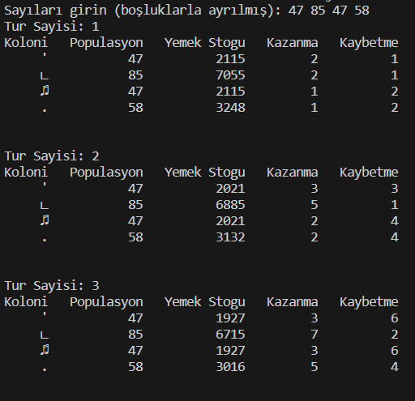
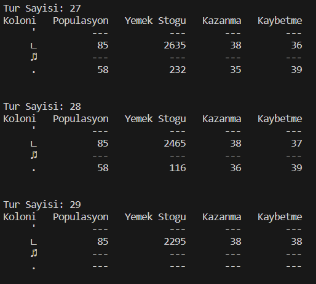

# Ödev Raporu

## Ödevde Öğrendiğim Kısımlar:

Ödevde Java programlama dilinde dönüşümler, Random sınıfının nasıl kullanıldığını, modüler bir şekilde uygulamayı yönetmeyi öğrendim. Ödevde kalıtım class larım arasında kalıtım ilişkisi kurdum, abstract classlar kullandım ve benden istendiği şekilde girilen sayılara göre koloniler oluşturup sonucu ekrana yazdırdım. Ödevden ekran görüntüsü :    

      

## Ödevde olabilecek  Hatalar
Ödevimde Koloni simgeleri olarak ascii kodlarını kullandım bazı ascii kodları ekranda yazılmıyor ve satır sütun düzeni bozuluyor olabiliyor. Eğer aynı sayılarla programı tekrar başlatırsanız sorun kalmaz.  
## Zorlandığım Kısımlar
Daha önce javayla çok çalışmadığım için programlama dilini ve programlama diliyle beraber kalıtım yapısını kullanırken zorlandım. Onun dışında ödev kolaydı çok zorlanmadım ve benden istenilenleri yaptığımı düşünüyorum.  

## Eksik Bıraktığım Kısımlar
Ödevde eksik kısım bırakmadım.
